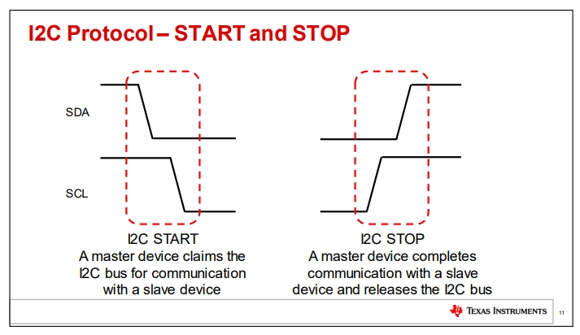
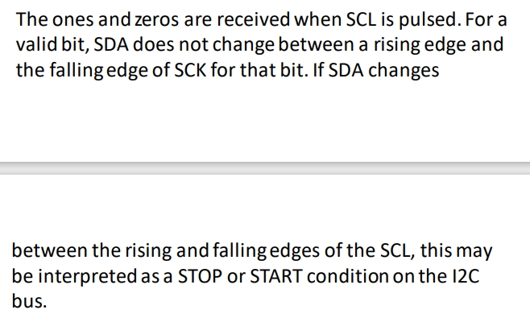
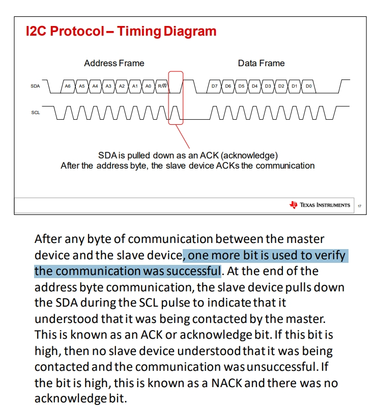

# Tape_i2c
this is a repo contain tape i2c softeare and hardware design.

*Notice:I am not the original mkaer of this idea! I just read an article about it and try to make it out.*

this i a the article I read[Tapei2c-hackday](https://hackaday.com/2021/05/03/i2c-paper-tape-reader-is-not-what-you-think/)

And I did not find any actuall design for this project so I create this repo

# learing i2c

此文件夹存放i2c 学习资料，主要来自Ti

## 重点信息 (from basics-of-i2c-the-i2c-protocol-presentation P11-P12) 
1. 开始和结束位

2. scl和sda周期频率一致，但是sda的占空比要大一些 

3. 有一个ACK位，但是因为这里只有单向的通讯，感觉问题不大

