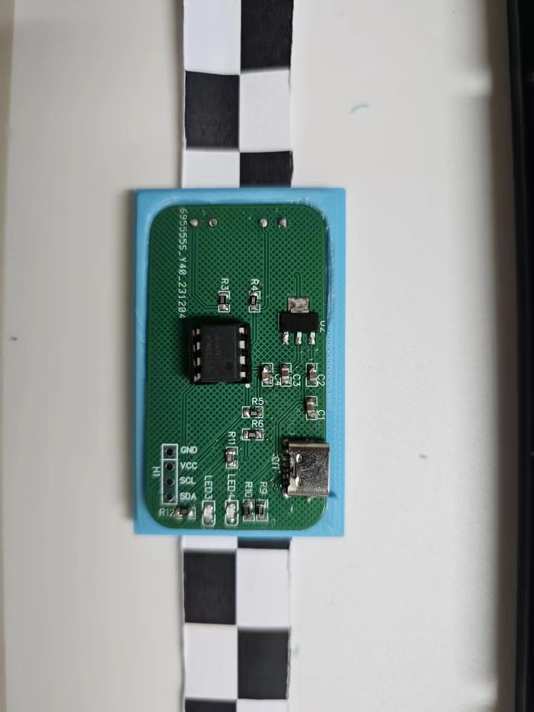

# Tape_i2c
this is a repo contain tape i2c softeare and hardware design.

*Notice:I am not the original mkaer of this idea! I just read an article about it and try to make it out.*

this i a the article I read[Tapei2c-hackday](https://hackaday.com/2021/05/03/i2c-paper-tape-reader-is-not-what-you-think/)

And I did not find any actuall design for this project so I create this repo

# hardware

硬件上是比较简单的，计划使用光敏电阻和比较器实现一个简单的检测电路，为了确保稳定，会增加一个补光灯，设计一个3d打印的黑室，确保每次的信号是类似的。

1. 电路部分的设计已经完成，并通过验证，PCB项目位于嘉立创
2. 3D打印的纸袋暗盒也设计完毕并且验证，尺寸需要做一点小修改

